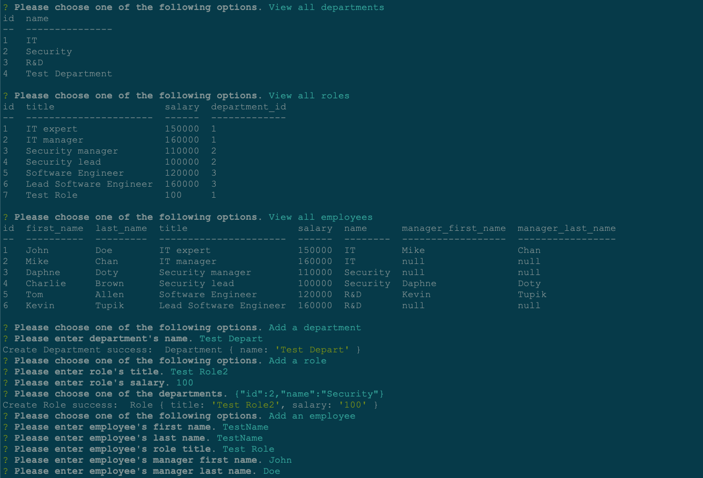

# Title: SQL Employee Tracker 

## Description

This is a command-line application for managing a company's employee database, using Node.js, Inquirer, and MySQL.

## Table of Contents

- [Title: SQL Employee Tracker ](#title-sql-employee-tracker-)
  - [Description](#description)
  - [Table of Contents](#table-of-contents)
  - [Installation](#installation)
  - [Usage](#usage)
  - [License](#license)
  - [Contributing](#contributing)
  - [Tests](#tests)
  - [Questions](#questions)

## Installation

npm install

## Usage

[Video link](https://watch.screencastify.com/v/rGRLKuH10nV09hKiDlqu)

To use this application, type in npm start (or node index.js) in command line.

When I start the application, then I am presented with the following options: view all departments, view all roles, view all employees, add a department, add a role, add an employee, and update an employee role

When I choose to view all departments, then I am presented with a formatted table showing department names and department ids

When I choose to view all roles, then I am presented with the job title, role id, the department that role belongs to, and the salary for that role

When I choose to view all employees, then I am presented with a formatted table showing employee data, including employee ids, first names, last names, job titles, departments, salaries, and managers that the employees report to

When I choose to add a department, then I am prompted to enter the name of the department and that department is added to the database

When I choose to add a role, then I am prompted to enter the name, salary, and department for the role and that role is added to the database

When I choose to add an employee, then I am prompted to enter the employee’s first name, last name, role, and manager, and that employee is added to the database

When I choose to update an employee role, then I am prompted to select an employee to update and their new role and this information is updated in the database

## License

MIT

## Contributing

## Tests

npm test

## Questions

GitHub Profile: https://github.com/annielawang.

If you have any questions about this application, you can reach me through annielawang@gmail.com.
